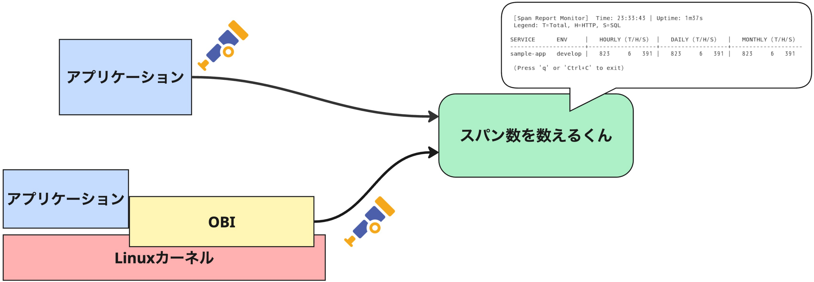
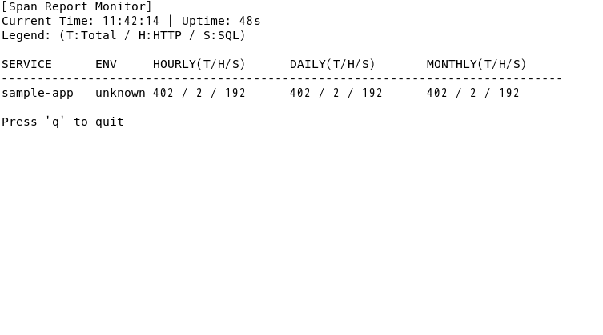

# Span Report Collector（スパン数を数えるくん）

[English](README.md)

`span-report-collector` は、受信したトレース（Span）の数を、`service.name` および `deployment.environment.name` ごとに集計し、時間・日・月単位の統計をファイルに出力します。



Collector 機能も持ち合わせているので、集計と同時に、本来のトレースデータを外部のバックエンド（Jaeger, SigNoz, Mackerel 等）へ転送するゲートウェイとしても機能します。

## 主な機能

* **属性別集計:** サービス名とサービス名前空間（dev/prodなど）の組み合わせごとにカウント。
* **TUIダッシュボード:** ターミナル上で動的に更新される統計画面を表示。
* **ゼロコンフィグ:** 設定ファイルなしで動作。環境変数で調整可能。
* **特定のワークロードの分類:** HTTPリクエストとSQLクエリを自動判別して個別に集計。
* **カレンダー同期:** 毎時 0 分 0 秒に統計をレポート出力（設定で変更可能）。
* **累積カウント:** 1時間ごとのリセットに加え、日次・月次の累計を保持。
* **デバッグモード:** `verbose: true` 設定により、受信時の即時ログ出力が可能。
* **マルチプラットフォーム対応:** Linux, macOS, Windows 用のバイナリを提供。

## インストール
https://github.com/kmuto/span-report-collector/releases から、お使いの OS とアーキテクチャに合った最新バージョンのバイナリをダウンロードしてください。

- **Linux / macOS**: `.tar.gz` 形式をダウンロードして展開します。
- **Windows**: `.zip` 形式をダウンロードして展開します。

## 実行方法

```sh
./span-report-collector
```

## TUI の操作方法



TUI モードでは、以下のキー操作が可能です。

* `q` または `Ctrl+C`: アプリケーションを終了します。
* 画面には以下の情報が表示されます：
  * **Uptime**: 起動からの経過時間
  * **Hourly / Daily / Monthly**: 各期間の累計（Total / HTTP / SQL）

## レポート形式

デフォルトでは `span_report.txt` に以下のような形式で追記されます。

```text
[2025-12-18 08:59:59] service:order-api, env:prod | Hourly(Total:1500, HTTP:1000, SQL:500) | Daily(Total:34200, HTTP:20000, SQL:14200) | Monthly(Total:120500, HTTP:80000, SQL:40500)
[2025-12-18 08:59:59] service:auth-svc, env:dev | Hourly(Total:120, HTTP:0, SQL:0) | Daily(Total:800, HTTP:0, SQL: 0) | Monthly(Total:5200, hTTP:0, SQL:0)
```

### カウンターの定義
- **Total**: すべての受信スパン。
- **HTTP**: `Kind=SERVER` および、`http.route` または `http.target` 属性を持つスパン。
- **SQL**: `db.query.text` または `db.statement` 属性を持つスパン。

### 統計値の性質とリセットタイミング

出力される各数値は、以下のルールに従って集計・リセットされます。

- **hourly**: 前回のレポート出力（通常は1時間前）から現在までのスパン数です。**レポート出力のたびに 0 にリセット**されます。
- **daily**: その日の 00:00:00 からの累積スパン数です。**日付が変わるタイミング（00:00:00 のレポート出力時）に 0 にリセット**されます。
- **monthly**: その月の 1日 00:00:00 からの累積スパン数です。**月が変わるタイミング（毎月1日 00:00:00 のレポート出力時）に 0 にリセット**されます。

> **Note:** コレクターを再起動した場合は、メモリ上の累積値（daily, monthly）は 0 にリセットされますのでご注意ください。

## カスタマイズ

### 環境変数によるカスタマイズ
以下の環境変数を使用して、動作をカスタマイズできます。

| 環境変数 | 説明 | デフォルト値 |
| --- | --- | --- |
| `SPAN_REPORT_TUI` | TUI モードを有効にする (`true` / `false`) | `true` |
| `SPAN_REPORT_VERBOSE` | 詳細ログを出力する（TUI 無効時を推奨）| `false` |
| `SPAN_REPORT_PATH` | 統計レポートファイルの出力先パス | `./span_report.txt` |
| `SPAN_REPORT_INTERVAL` | ファイル出力の更新間隔（例: `1h`, `30m`） | `1h` |
| `SPAN_REPORT_OTLP_ENDPOINT_GRPC` | gRPC レシーバーの待機アドレス | `localhost:4317` |
| `SPAN_REPORT_OTLP_ENDPOINT_HTTP` | HTTP レシーバーの待機アドレス | `localhost:4318` |

#### ポートを外部へ公開する場合

自ホストではなくほかのホストからのトレースを受け取るには、以下のように待機アドレスの環境変数を指定して実行します。

```sh
SPAN_REPORT_OTLP_ENDPOINT_HTTP=0.0.0.0:4318 ./span-report-collector
```

## コンテナで利用する

span-report-collector の Docker イメージを GitHub Container Registry `ghcr.io/kmuto/span-report-collector:latest` で提供しています。

```sh
docker pull ghcr.io/kmuto/span-report-collector:latest
```

Docker Composeでの設定例を示します。レポートをホスト側で確認できるよう、ファイルをマウントすることをお勧めします。

```yaml
services:
  span-report-collector:
      image: ghcr.io/kmuto/span-report-collector:latest
      environment:
        - SPAN_REPORT_PATH=/logs/span_report.txt
      volumes:
        - ./logs:/logs
      networks:
        - mynetwork
```

コンテナ環境での互換性を確保するために、コンテナイメージは以下のデフォルト設定がされています:

* **`SPAN_REPORT_TUI=false`**: コンテナは非インタラクティブモードで通常動作するので、デフォルトで無効
* **`SPAN_REPORT_OTLP_ENDPOINT_GRPC=0.0.0.0:4317`**: コンテナネットワーク内からのトレース送信を許可する設定
* **`SPAN_REPORT_OTLP_ENDPOINT_HTTP=0.0.0.0:4318`**: コンテナネットワーク内からのトレース送信を許可する設定

## 独自の構成ファイルを使用する

独自の `config.yaml` を使用したい場合は、`--config` フラグを使用します。この場合、上記の環境変数は無視され、指定したファイルの記述が優先されます。

```bash
./span-report-collector --config my-custom-config.yaml
```

展開されたフォルダに以下の `config.yaml` を用意しています。

#### 受け取ったものをMackerelにも送る例

```yaml
receivers:
  otlp:
    protocols:
      grpc:
        endpoint: localhost:4317
      http:
        endpoint: localhost:4318

exporters:
  spanreportexporter:
    path: "./span_report.txt"
    report_interval: "1h"
    tui: false
    verbose: false
  otlphttp/mackerel:
    endpoint: https://otlp-vaxila.mackerelio.com
    sending_queue:
      batch:
        flush_timeout: 10s
        max_size: 5120
    compression: gzip
    headers:
      Mackerel-Api-Key: ${env:MACKEREL_APIKEY}

service:
  telemetry:
    logs:
      level: error
  pipelines:
    traces:
      receivers: [otlp]
      exporters: [spanreportexporter, otlphttp/mackerel]
```

## ライセンス
```
Copyright 2025 Kenshi Muto

Licensed under the Apache License, Version 2.0 (the "License");
you may not use this file except in compliance with the License.
You may obtain a copy of the License at

    http://www.apache.org/licenses/LICENSE-2.0

Unless required by applicable law or agreed to in writing, software
distributed under the License is distributed on an "AS IS" BASIS,
WITHOUT WARRANTIES OR CONDITIONS OF ANY KIND, either express or implied.
See the License for the specific language governing permissions and
limitations under the License.
```
